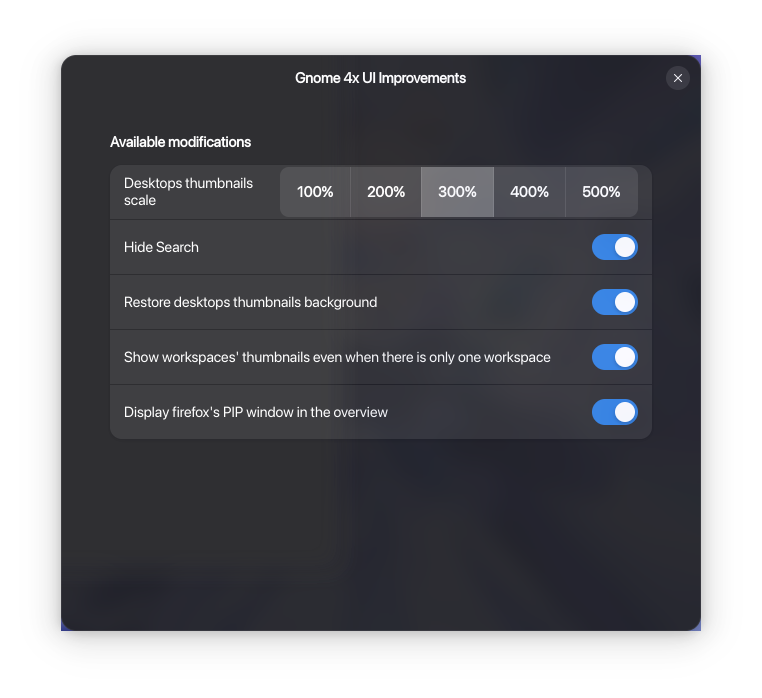

# GNOME Extensions Setup Guide

## 1. Gnome 4x UI Improvements

- **Description:** UI improvements for GNOME.
- **Download:** [Gnome 4x UI Improvements](https://extensions.gnome.org/extension/4158/gnome-40-ui-improvements/)
- **Setup:**
  1. Download and install from the link above or through **Extension Manager**.
  2. Enable the extension using GNOME Extensions app or Extension Manager.
  3. Follow the steps in below screenshot:
  
  

## 2. Blur My Shell

- **Description:** Adds blur effects to GNOME Shell, Dock and Applications.
- **Download:** [Blur My Shell](https://extensions.gnome.org/extension/3193/blur-my-shell/)
- **Setup:**
  1. Download and install from the link above or through **Extension Manager**.
  2. Enable the extension using GNOME Extensions app or Extension Manager.
  3. Create all the [**Pipelines**](extensions/blur-my-shell/pipelines/) first.
  4. See [step1.png](extensions/blur-my-shell/step1.png) to [step5.png](extensions/blur-my-shell/step5.png) for setup visuals.

## 3. Dash to Dock

- **Description:** Moves the GNOME dash out of the overview and transforms it into a dock.
- **Download:** [Dash to Dock](https://extensions.gnome.org/extension/307/dash-to-dock/)
- **Setup:**
  1. Download and install from the link above or through **Extension Manager**.
  2. Enable the extension using GNOME Extensions app or Extension Manager.
  3. See [step1.png](extensions/dash-to-dock/step1.png), [step2-1.png](extensions/dash-to-dock/step2-1.png), [step2-2.png](extensions/dash-to-dock/step2-2.png), [step3.png](extensions/dash-to-dock/step3.png), [step4.png](extensions/dash-to-dock/step4.png) for setup visuals.

## 4. Open Bar

- **Description:** macOS-style top bar for GNOME.
- **Download:** [Open Bar](https://extensions.gnome.org/extension/6580/open-bar/)
- **Setup:**
  1. Download and install from the link above or through **Extension Manager**.
  2. Enable the extension using GNOME Extensions app or Extension Manager.
  3. To import the config:
     - Open Open Bar settings (Extension Manager → Open Bar → Settings).
     - Go to the `Admin` tab.
     - Click `Import` and select the provided config files - [Dark Mode](extensions/openBar/Tahoe-Dark) and [Light Mode](extensions/openBar/Tahoe-Light)

## 5. Space Bar

- **Description:** Space-themed workspace indicator for GNOME.
- **Download:** [Space Bar](https://extensions.gnome.org/extension/5090/space-bar/)
- **Setup:**
  1. Download and install from the link above.
  2. Enable via GNOME Extensions app.
  3. See [step1.png](extensions/space-bar/step1.png) to [step4.png](extensions/space-bar/step4.png) for setup visuals.

## 6. Tiling Shell

- **Description:** Tiling window management for GNOME Shell.
- **Download:** [Tiling Shell](https://extensions.gnome.org/extension/7065/tiling-shell/)
- **Setup:**
  1. Download and install from the link above.
  2. Enable via GNOME Extensions app.
  3. To import the config:
     - Open Tiling Shell settings.
     - Scroll down to the last section.
     - Click `Import` and select the provided [config file](extensions/tiling-shell/tilingshell-settings.txt).
