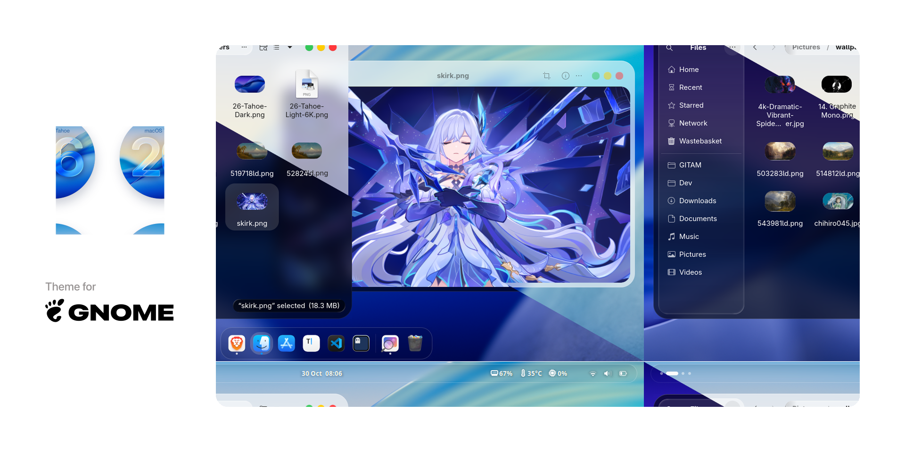
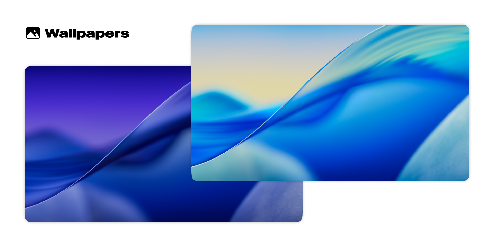

<p align="center">  </p>

<br>
<p align="center"> <b> A macOS Tahoe like theme for GNOME Desktops </b> </p>
<br>

## Donate

If you like my project, you can buy me a coffee, many thanks ❤️ !

<a href="https://www.buymeacoffee.com/kayozxo"></a>

# Installation is easy!

<details> <summary> Recommended applications </summary>

- [Ulauncher (Application Launcher)](https://ulauncher.io/#Download)
- [GNOME Tweaks]() or [Refine (Recommended)](https://flathub.org/apps/page.tesk.Refine)

</details>

<details> <summary> Recommended GNOME Shell extensions </summary>

- [Open Bar](https://extensions.gnome.org/extension/6580/open-bar/)
- [Blur My Shell](https://extensions.gnome.org/extension/3193/blur-my-shell/)
- [Dash to Dock](https://extensions.gnome.org/extension/307/dash-to-dock/)
- [Gnome 4x UI Improvements](https://extensions.gnome.org/extension/4158/gnome-40-ui-improvements/)
- [Space bar](https://extensions.gnome.org/extension/5090/space-bar/)
- [Tiling Shell](https://extensions.gnome.org/extension/7065/tiling-shell/)
- [User Themes](https://extensions.gnome.org/extension/19/user-themes/)
- [Vitals](https://extensions.gnome.org/extension/1460/vitals/)
- [Wallpapers](./.config/walls)

</details>

## Quick install

### Interactive Installer (Recommended!)

**Run the installer — it will automatically install [Gum](https://github.com/charmbracelet/gum) if needed!**

```bash
git clone https://github.com/kayozxo/GNOME-macOS-Tahoe
cd GNOME-macOS-Tahoe
./install.sh
```

**No flags needed!** The installer will provide an interactive menu to guide you through:

- 🎨 Install Light/Dark/Both themes
- 🌈 Generate and install accent color variants (all 16 or specific)
- 🖼️ Install generated accent variants to ~/.themes
- ⚙️ Install libadwaita override (for modern GTK4 apps & GNOME Shell)
- 🎯 Install extras: MacTahoe icons, MacTahoe wallpapers, WhiteSur cursors, Ulauncher theme and GDM theme
- 🧹 Uninstall themes
- 📖 Help & documentation

### Command-line Usage (Advanced)

If you prefer command-line flags over the interactive menu:

```bash
# Install themes
./install.sh -l    # Light theme only
./install.sh -d    # Dark theme only
./install.sh -u    # Uninstall

# Install wallpapers
./install.sh -w    # Tahoe 26 dynamic wallpapers

# Generate accent colors
./install.sh --colors        # Generate all 16 variants
./install.sh --color blue    # Generate specific color

# Install with libadwaita support
./install.sh -d -la                 # Dark + libadwaita
./install.sh -d --color blue -la    # Dark blue + libadwaita + GNOME Shell
```

### Updating

1. Run `cd GNOME-macOS-Tahoe`
2. Run `git pull origin main`
3. Run `./install.sh` again

Then continue from [here](.config/EXTENSIONS.md)

## Accent Colors

Tahoe now supports **16 beautiful accent colors** with complete theming support across **GTK4, GTK3, and GNOME Shell**! Generate and install accent color variants easily:

### Examples

```bash
# Generate all 16 accent color variants
./install.sh --colors

# Generate and install specific color (dark & light)
./install.sh --color blue

# Dark mode only with purple accent
./install.sh -d --color purple

# Light mode only with green accent
./install.sh -l --color green

# Libadwaita fix with colored theme
./install.sh -d --color blue -la
```

### Available Color

| Color  | Color   |
| ------ | ------- |
| Blue   | Rose    |
| Green  | Emerald |
| Purple | Violet  |
| Pink   | Amber   |
| Orange | Cyan    |
| Red    | Lime    |
| Teal   | Sky     |
| Indigo | Slate   |

**After installation**, select your preferred color variant in **Tweaks → Appearance** (e.g., `Tahoe-Dark-Blue`, `Tahoe-Light-Green`, `Tahoe-Dark-Amber`, etc.). The accent colors will apply to all applications and GNOME Shell elements including dash, notifications, popups, and more!

## Wallpapers

<p align="center"><a href=".config/walls/"></a></p>

## Fix for libadwaita (not perfect)

<details> <summary> Details <b>(click to open)</b> </summary>

Since the release of `Gnome 43.0`, more and more built-in apps use `libadwaita` now, and libadwaita does not support custom themes, which means we cannot change the appearance of app using libadwaita through `gnome-tweaks` or `dconf-editor`. For users who love custom themes, it’s really sucks!

Anyway if anybody who still want to custom themes we can only do this way:

That is to use the `theme file` to overwrite the `gtk-4.0 configuration file`. The result is that only Fixed making all gtk4 apps use one theme and cannot be switched (even can not switch to dark mode) If you want to change a theme, you can only re-overwrite the `gtk-4.0 configuration file` with a new theme, I know this method is not perfect, But at the moment it is only possible to continue using themes for libadwaita's apps ...

</details>

Run this command to install `Tahoe` into `gtk-4.0 configuration folder` ($HOME/.config/gtk-4.0) for libadwaita applications:

```bash
./install.sh -l -la          # install light theme for libadwaita
./install.sh -d -la          # install dark theme for libadwaita
./install.sh -d --color blue -la    # install dark blue theme for libadwaita
./install.sh -l --color green -la    # install light green theme for libadwaita
```

**Note:** The `-la` flag also applies the accent color to GNOME Shell elements (dash, notifications, popups, etc.) when used with `--color`.

## Fix for Flatpak

#### 1. Run command to fix it

```sh
sudo flatpak override --filesystem=xdg-config/gtk-3.0 && sudo flatpak override --filesystem=xdg-config/gtk-4.0
```

If you use flatpak apps, you can run this to fix theme issue

#### 2. Connect Tahoe theme to Flatpak (gtk 3.0) (Snap not support)

Parameter: `--flatpak`

Example: `./install.sh --flatpak`

## ✅ Done!

If you like my project, you can buy me a coffee, many thanks ❤️ !

<a href="https://www.buymeacoffee.com/kayozxo"></a>

Reboot or log out and back in — your GNOME should now resemble **macOS Tahoe**!

If you face any issues or have questions, feel free to open an issue on the repo or drop a comment on [my Reddit post](https://www.reddit.com/r/unixporn/comments/1ogcgqg/gnome_macos_tahoe_v060/?utm_source=share&utm_medium=web3x&utm_name=web3xcss&utm_term=1&utm_content=share_button).
